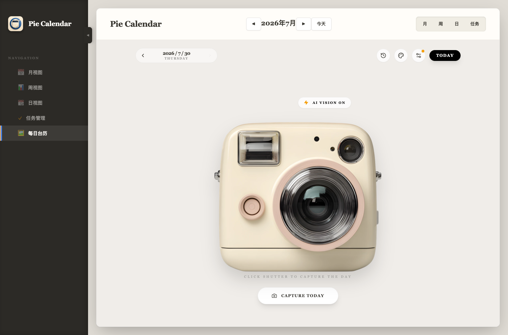
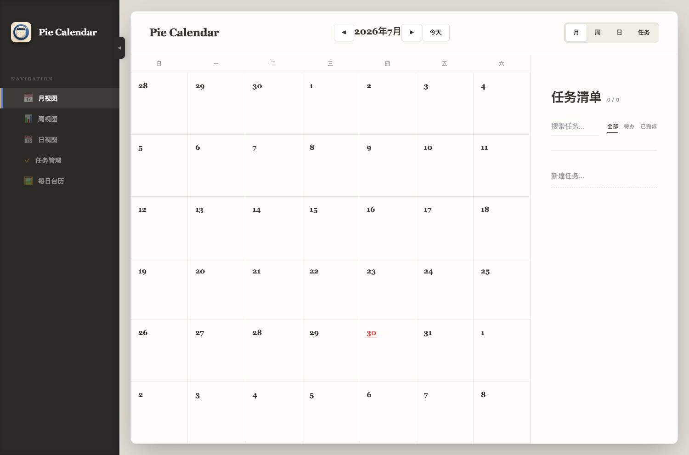

<p align="center">
  
</p>

<h1 align="center">Pie Calendar</h1>

<p align="center">
  一款本地优先的桌面日历，将日程、任务与 AI 每日台历放进同一个工作空间。
</p>

<p align="center">
  <a href="https://github.com/Ma-benjiang/calendar-app/releases/latest">
    
  </a>
  <a href="https://github.com/Ma-benjiang/calendar-app/actions/workflows/ci.yml">
    
  </a>
  <a href="https://github.com/Ma-benjiang/calendar-app/releases">
    
  </a>
  <a href="LICENSE">
    
  </a>
</p>

<p align="center">
  <a href="https://github.com/Ma-benjiang/calendar-app/releases/latest"><strong>下载最新版</strong></a>
  ·
  <a href="#核心功能">核心功能</a>
  ·
  <a href="#本地开发">本地开发</a>
  ·
  <a href="CONTRIBUTING.md">参与贡献</a>
</p>

<p align="center">
  
</p>

## 下载

前往 [GitHub Releases](https://github.com/Ma-benjiang/calendar-app/releases/latest) 获取最新安装包。

| 平台 | 安装包 | 架构 |
| --- | --- | --- |
| macOS | DMG / ZIP | Apple Silicon |
| Windows | NSIS EXE | x64 |
| Linux | AppImage | x64 |

> 当前安装包未进行 Apple 或 Microsoft 商业证书签名，系统首次启动时可能显示安全提醒。请仅从本仓库 Releases 页面下载安装包。

## 产品预览

<p align="center">
  
</p>

## 核心功能

### 日历与任务

- 月、周、日视图统一管理日程。
- 任务清单支持创建、编辑、完成状态和拖拽安排。
- 桌面端使用 SQLite 保存业务数据，不依赖在线账户。

### AI 每日台历

- 自动组合公历、星期、农历、节气和中国法定节假日信息。
- DeepSeek 一次生成每日文案与视觉 Prompt。
- Seedream 或 OpenAI GPT Image 生成无文字背景图。
- 应用在本地叠加准确日期、农历、节日和每日文案。
- 主题支持“随机”和“手动”两种策略，保存配置不会自动生图。

### 时光相册

- 仅允许生成今天的台历。
- 再次点击相机会覆盖当天图片，不保留同一天的多个版本。
- 历史日期只读，只有已经生成过的日期可以打开。
- 生成图片保存到桌面应用数据目录，可离线查看历史记录。

### 中国节假日

应用按年份静默同步中国法定节假日与调休工作日，并将结果缓存到本地。首次访问年份或缓存超过 30 天时才会更新，断网时继续使用最近一次成功同步的数据。

节假日数据来自 [NateScarlet/holiday-cn](https://github.com/NateScarlet/holiday-cn)。

## AI 模型配置

在“每日台历”右上角打开模型设置。

| 用途 | 提供商 | 用户配置 |
| --- | --- | --- |
| 每日文案与视觉 Prompt | DeepSeek | 模型 ID、API Key |
| 图片生成 | 火山引擎 Seedream | 模型 ID、API Key |
| 图片生成 | OpenAI | API Endpoint、模型 ID、API Key |

DeepSeek 与火山引擎的 API Endpoint 由应用内置，不需要手动填写。API Key 保存在当前设备，但目前未加密；请勿在公共设备中保存生产密钥。

## 技术架构

| 层级 | 技术 |
| --- | --- |
| 桌面运行时 | Electron |
| 渲染层 | React 18、TypeScript、Vite |
| UI | Tailwind CSS、Framer Motion |
| 本地存储 | SQLite、文件系统 |
| AI | Vercel AI SDK、DeepSeek、Seedream、OpenAI Images API |
| 工程化 | pnpm workspace、Turborepo、Vitest、GitHub Actions |

```text
calendar-app/
├── apps/
│   ├── desktop/       # Electron 主进程、IPC 与打包配置
│   └── renderer/      # Vite 渲染入口
├── packages/
│   ├── core/          # 日历与事件领域逻辑
│   ├── storage/       # SQLite / localStorage 适配器
│   └── ui/            # React 界面与每日台历功能
└── scripts/           # 版本校验与发布工具
```

## 本地开发

### 环境要求

- Node.js 22+
- pnpm 11.1+
- macOS、Windows 或 Linux

```bash
git clone https://github.com/Ma-benjiang/calendar-app.git
cd calendar-app
pnpm install --frozen-lockfile
pnpm dev
```

常用命令：

```bash
pnpm lint             # 代码检查
pnpm test             # 全仓测试
pnpm build:renderer   # 构建渲染层
pnpm build:desktop    # 构建当前平台安装包
```

## 发布流程

Pull Request 只运行一次 lint、测试与渲染构建。合并到 `master` 后，推送与项目版本一致的 `v*` 标签，Release workflow 才会构建三个平台的安装包并创建 GitHub Release。

```bash
pnpm version:set 1.6.0
pnpm version:check

git tag -a v1.6.0 -m "Release v1.6.0"
git push origin v1.6.0
```

Tag 与包版本不一致时，发版会自动终止。

## 贡献

提交问题或功能建议请使用 [GitHub Issues](https://github.com/Ma-benjiang/calendar-app/issues)。代码贡献流程见 [CONTRIBUTING.md](CONTRIBUTING.md)。

## License

[MIT](LICENSE)
